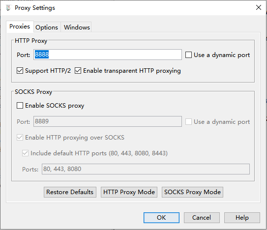
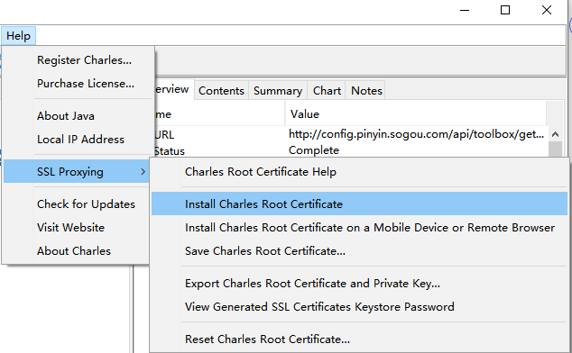
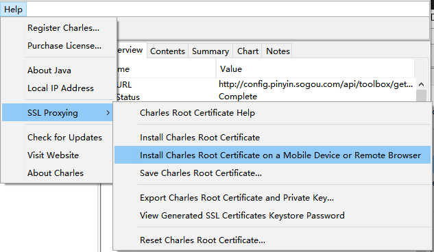
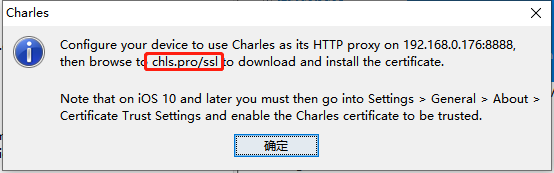
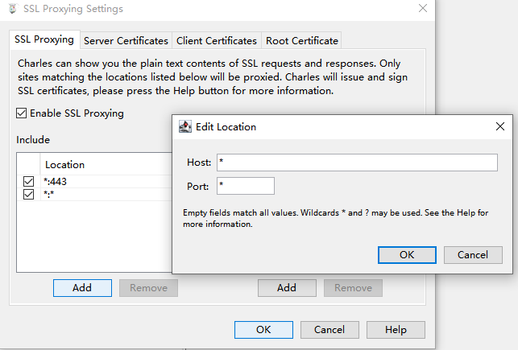
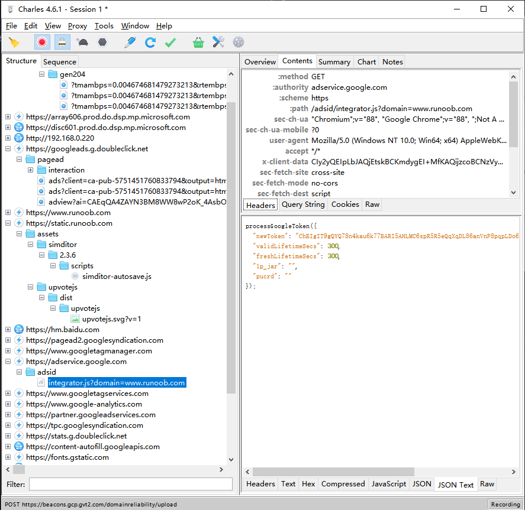

在生产测试中，有时候我们可能使用到抓包工具，下面介绍一下抓包工具charles的使用方法，本文主要记录charles的安装，配置代理和https的SSL证书
## 1.安装
我们需要到官网下载[charles](https://www.charlesproxy.com/download/)，选择自己系统的包，进行安装，我自己的就是windows 64 bit 版本为4.6.1。安装就正常的下一步就可以了。
## 2.配置移动端代理
 * 首先我们需要把手机和电脑连在同一Wifi，确保手机与电脑在同一网络环境下。
 * 然后打开charles的proxy下的proxy settings可以看到默认端口为8888  
 
 * 手机端配置代理，以我手机的ios系统为例  设置->无线局域网->选择连接wifi的后最后一个蓝色小图标->配置代理->选择手动。服务器就是你电脑的IP地址，端口就是上图所示端口。这样手机发出的网络请求也可以抓到了。
## 3. 配置ssl代理
主要是为了抓到https的包，解决unknown和乱码问题。证书的安装分为手机端和电脑端
### 3.1安装电脑端证书
* 点击Charles工具栏上的help->ssl proxying->Install Charles Root Certificate

* 弹出界面点击安装证书，一定要选择当前用户，不知道为啥，网上说的，点击下一步，选择将所有证书都放入下列储存，选择受信任的证书颁发机构，确定即可。
### 3.2安装手机端证书
* 点击如下选项
* 手机浏览器进入 如下网址安装描述文件，下载好之后，ios进入设置->通用，拉到最后，点击描述文件信任安装。

* ios设置根证书信任 设置->通用->最后的证书信任设置。把刚刚安装的描述文件打开
### 3.3配置ssl代理
* 点击charles工具栏下的SSL ProxyingSettings
* 勾选Enable SSL Proxying
* 点击include下的add，这里设置的是你需要抓包的网址，如果想要监听所有就都设置为 * 即可。
  
这样我们基本就可以实现一般请求抓取了  
